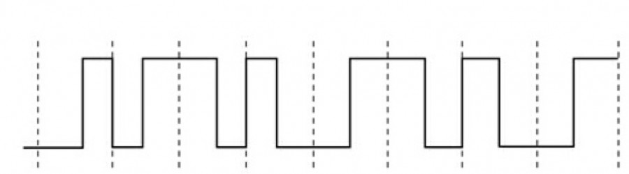

##2.1数据与传输介质
1、(1分)模拟数据的取值为一定范围的离散值。√
正确 错误
2、(1分)振幅反映____,周期频率反映____,相位反映____。（请填入小写字母，答案用空格隔开）
a.单位时间内完成的周期数

b.初始的波形相对状态

c.信号的强度

√

c a b
3、(1分)保真度表示接收到的信号与发出的信号比较，两者间的差异有多大。√
正确 错误
4、(1分)双绞线使用缠绕在一起的铜芯电线原因是：√
 A、 减少不同电线间和外界的干扰
 B、 增加单位体积可容纳铜线数量
 C、 增加信号传输距离
 D、 增加信号传输距离
5、(1分)信号强度的单位是：√
 A、 瓦特
 B、 信噪比
 C、 分贝
 D、 毫瓦分贝
6、(1分)信号的幅度降低称为失真。√
正确 错误
7、(1分)波特率表示信号速率，比特率表示数据传输速率。√
正确 错误
8、(1分)根据尼奎斯特准则，给定任意一个数字信道，其容量没有上限。√
正确 错误
9、(1分)根据香农定律，给定任意一个信噪比确定的模拟信道，其容量没有上限。√
正确 错误
10、(1分)一个信道每1/8s采样一次，传输信号共有16种变化状态，则最大数据传输速率是：√
 A、 16 bit/s
 B、 32 bit/s
 C、 64 bit/s
 D、 48 bit/s
 
 ## 2.2数据编码技术
 1、(1分)
 
 
 
若上图为10 BaseT网卡(采用曼切斯特编码)接收到的信号波形，则该网卡收到的比特串是：

×
 A、 00110001
 *B、 11001001*
 C、 01010010
 D、 10101101
2、(1分)以下哪种数字数据编码方式属于自含时钟编码？√
 *A、 曼彻斯特编码*
 B、 非归零码
 C、 脉冲编码
 D、 二进制编码
3、(1分)下列哪一项是基带传输三种调制方式之一的调频的特点：√
 A、 对噪声的抗干扰性和频率利用率等方面都具有明显的优势
 *B、 抗衰落和抗噪声性能优于调幅，设备简单易实现*
 C、 调制后的信号具有周期信号的特征
 D、 受到系统增益的影响，频率利用率低
4、(1分)高频正弦型信号因其形式简单、易于产生，它的三个参量（振幅、周期、相位）特征比较明显，常被选为调制解调中的载波。√
*正确* 错误

1、(1分)数字化过程的步骤为_____、_____、_____。（请按顺序作答，答案用空格隔开）√

采样 量化 编码
2、(1分)要使得信号采样后不失真并能还原，采样频率必须大于信号最高频率的两倍。√
*正确* 错误
3、(1分)在数字化过程的采样中，抽样后的样值序列是脉幅调制信号，脉幅调制信号是：√
 *A、 模拟信号*
 B、 数字信号
 
 ## 2.4多路复用技术
 1、(1分)以信道传输时间作为分割对象，通过多个信道分配互不重叠的时间片的方法来实现多路复用技术的是：√
 A、 FDM
 B、 CDM
 *C、 TDM*
 D、 WDM
2、(1分)正交频分多路复用信号重叠会产生干扰。√
正确 *错误*
3、(1分)频分多路复用必须保证各路信号互不重叠。√
*正确* 错误
4、(1分)时分多路复用中，每个子信道在自己的时间片内可以使用全部带宽。√
*正确* 错误

## 小节课作业

1、(3分)以下对单工通信说明正确的是：√
 A、 任何时候只允许在一个方向上传输
 B、 允许双方交替地向对方传输信息
 C、 任何时候只允许按照一个方向传输
 D、 允许在两个方向上同时传输
答案： C
2、(3分)考虑语音信道带宽为1000赫兹，信噪比为20分贝。请问该信道的容量为____ bps。(保留至小数点后一位)√

6658.2
答案： 6658.2
3、(3分)噪声的度量单位是：√
 A、 毫瓦分贝
 B、 分贝
 C、 信噪比
 D、 瓦特
答案： C
4、(3分)不归零编码相比于归零编码带宽利用率_____，同步能力_____。（高/低，答案用空格隔开）√

高 低
答案： 高 低
5、(3分)下列属于调制解调技术的有：×
 A、 将模拟数据转换为模拟信号
 B、 将数字数据转换为数字信号
 C、 将模拟数据转换为数字信号
 D、 将数字数据转换为模拟信号
答案： A,D
6、(3分)载波频率的选择可以与传输介质不兼容。√
正确 错误
答案： 错误
7、(3分)下列属于调制技术的有：√
 A、 调幅
 B、 调相
 C、 调频
 D、 调整
答案： A,B,C
8、(3分)下列说法错误的是：√
 A、 数字化是计算机处理模拟数据的前提
 B、 模拟数据经数字化后可以被数字传输或模拟传输
 C、 模拟数据的数字化精度和数据内容有关
 D、 模拟数据被调制到更高频模拟信号上无法获得更大的线路利用率
答案： D
9、(3分)各用户可以使用相同频率载波发送信息的多路复用技术是：×
 A、 CDM
 B、 WDM
 C、 TDM
 D、 FDM
答案： A,C