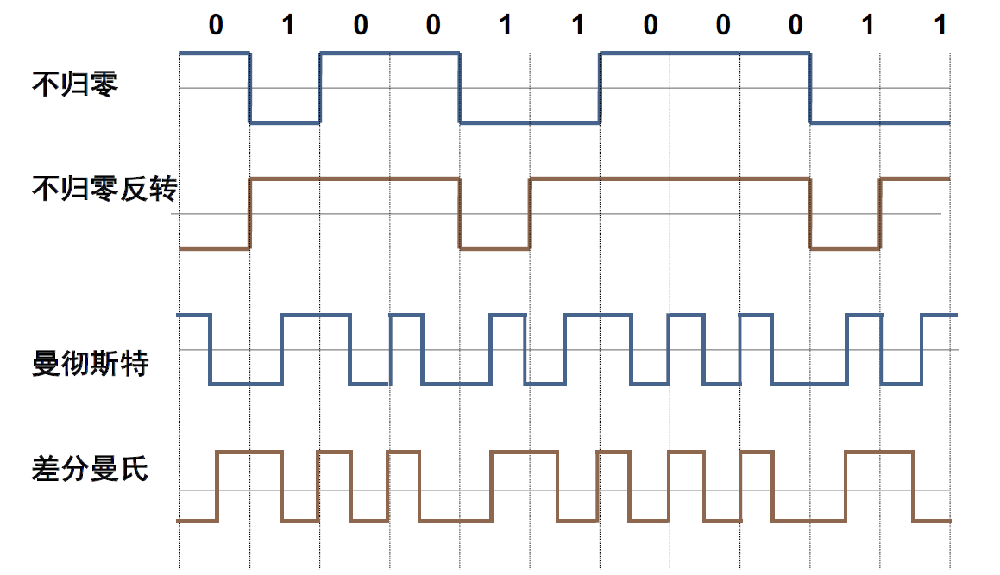
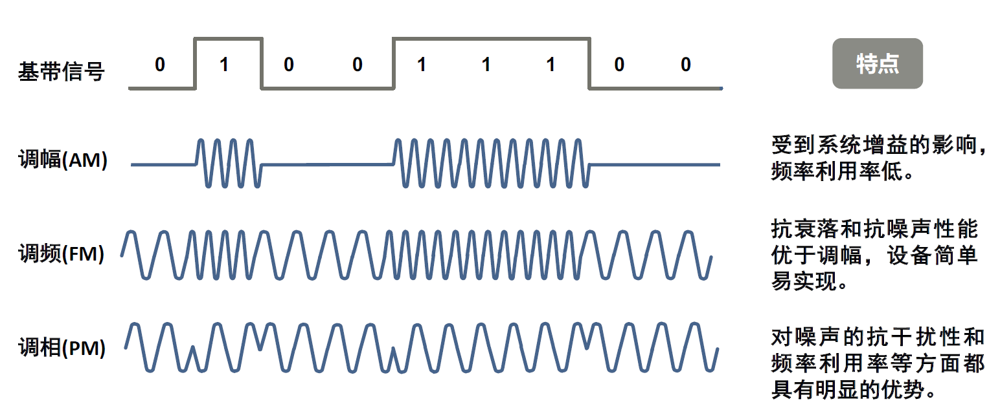
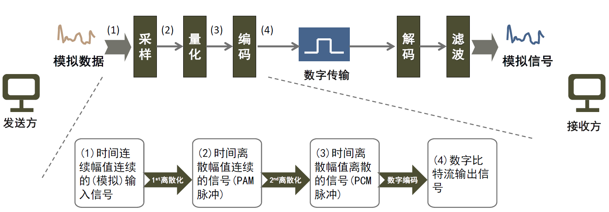

总结补充
=======
<!-- TOC -->
- [Ch01-网络概述](#Ch01-网络概述)
- [Ch02-通信概述](#Ch02-通信概述)
- [Ch03-数据链路层](#Ch03-数据链路层)
- [Ch04-网络层](#Ch04-网络层)
- [Ch05-传输层](#Ch05-传输层)
- [Ch06-应用层](#Ch06-应用层)
<!-- TOC -->

## Ch01-网络概述

- 什么是计算机网络：计算机网络是由若干地理上分散的、具有独立功能的计算机系统（用户终端）利用各种通信系统连接起来而形成的计算机系统集合

- 计算机网络的五大基本元素：主机、交换结点、通信链路、拓扑结构、通信软件

- 分类概述

按网络覆盖范围：个域网、局域网、城域网、广域网

按网络传输技术：广播发送、点-点传输

*按数据交换技术：电路交换、包交换*

按传输介质：有线网络、无线网络

- 广播网络

广播网络只有一个通信信道（共享介质），网络上所有的主机/节点共享该信道进行数据通信

1. 单播：一对一，发送者将信息发送给指定的某个接收者
2. 广播：一对全部，发送者将信息发送给网络上的全部用户，即用户要接收全部的广播信息
3. 组播：一对多，发送者将消息发给网络上符合某种特性的一组用户

介质访问控制(MAC,Medium Access Control):

静态分配：固定分配模式、控制算法简单、资源利用率低

动态分配：按需分配模式、控制算法复杂、资源利用率高

- 点-点网络

拓扑结构：星型、环型、树型、全连通

- 电路交换vs包交换

- 计算机网络性能评价指标

1. 带宽
2. 时延
3. 往返时间RTT
4. 吞吐量
5. 速率

- 计算机网络协议的三要素：语法（数据结构、编码、信号电平等）、语义（用于协调和差错处理的控制信息）、时序（传输速率匹配和事件先后顺序）

- 实通信（相邻层的通信）、虚通信（对等实体进行的通信）

- 服务（上下关系）
1. 服务是各层向它的上层提供的一组原语（操作）
2. 服务定义了该层能为它的用户完成的操作
3. 服务只与两层之间的接口有关

- 协议（水平关系）
1. 协议是一组规则
2. 决定同层对等实体交换帧、包和报文的格式和意义
3. 实体用协议来实现它们向上提供的服务

## Ch02-通信概述
- 信道通信方式：单工通信Simplex,半双工通信Half-deplex,全双工通信Full-deplex

- 模拟数据：在某个时间间隔内具有连续值的数据（语音、图像）

- 数字数据：数据的取值有离散特性（文本、数据）

- 周期信号的三个特征：振幅、周期/频率、相位

- 信号强度计量：分贝 D=10*log_10(p1/p2)

- 噪声：R(s/n)=10*log_10(S/N) S为平均信号功率，N为噪声功率

- 信号衰减vs信号失真

- 比特率

- 波特率

- Nyquist准则 C=2Wlog2L

按照尼奎斯特准则，给定任意一个数字信道，其容量没有上限

-Shannon定律：在信号平均功率有限的白噪声信道中，信道的极限数据传输率为： C=Wlog2(1+S/N)

- 基带信号：未经频率变换处理的原始电信号，即来自数据源的信号

- 基带传输：一种不搬移基带信号频谱的传输方式

- 通带传输：把基带信号经过载波调制后，把信号的频率范围搬移到较高频段以便在信道中传输

- 基带传输编码

- 基带传输的调制方式

- 数字化过程

1. 采样定理：如果在规定时间间隔内，以高于两倍最高有效信号频率的速率对信号f(t)进行采样，那么这些采样值包含了原始信号的全部信息。

## Ch03-数据链路层

-数据链路层功能：把单个比特传输功能扩展成块数据的传输

## Ch04-网络层

## Ch05-传输层

## Ch06-应用层