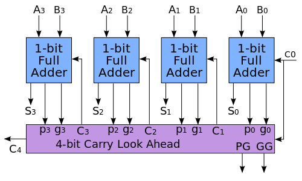
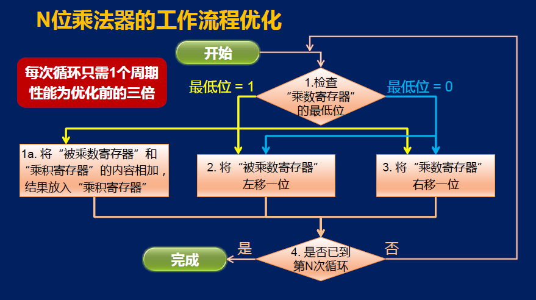
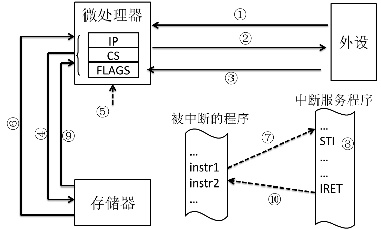
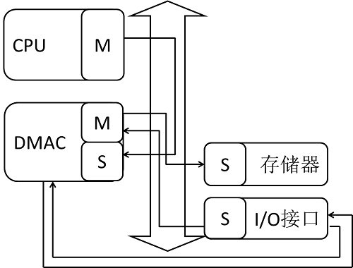

Final Exam - Week 12
====================

计算机组成期末试卷
---------

1、 ( 4分 )以下人物中，没有参与电子计算机ENIAC研发工作的是

  **A、 约翰•阿塔纳索夫**

  B、 约翰•莫克利

  C、 约翰•埃克特

  D、 约翰•冯•诺依曼

*约翰•阿塔纳索夫，1939年在美国艾奥瓦州立大学参与研发了ABC(阿塔纳索夫-贝里 计算机)*

2、 ( 4分 )指令执行的四个基本步骤为

  A、 取指、发射、执行、访存

  **B、 取指、译码、执行、写回**

  C、 取指、读数、运算、完成

  D、 取指、分派、计算、提交

3、 ( 4分 )以下属于冯•诺依曼计算机结构五大组成部分的是

  **A、 控制器**

  **B、 存储器**

  C、 加法器

  D、 编译器

  E、 乘法器

  F、 链接器

  G、 寄存器

*冯·诺伊曼计算机结构的五大组成部分：运算器、控制器、存储器、输入设备、输出设备*

4、 ( 4分 )下面对RISC和CISC的描述中，错误的是：

  **A、 CISC指令系统中的指令编码长度不固定；RISC指令系统中的指令编码长度固定，这样使得RISC机器可以获得了更短的代码长度。**

  **B、 CISC机器中的寄存器数目较少，函数参数必须通过栈来进行传递；RISC机器中的寄存器数目较多，只需要通过寄存器来传递参数。**

  C、 CISC指令系统中的指令数目较多，有些指令的执行周期很长；而RISC指令系统中通常指令数目较少，指令的执行周期都较短。

  D、 CISC指令系统支持多种寻址方式，RISC指令系统支持的寻址方式较少。

| |CISC(x86)|RISC(MIPS)|
|:-----:|:--------:| :--------: |
|指令系统|复杂、庞大|简单、精简|
|指令数目|200条以上|31条|
|指令字长|不固定|等长|
|可访存指令|不加限制|Load(lw)/Store(sw)|
|通用寄存器数量|较少|多|
|寻址方式|>=4|<=4|
|目标代码|难以用优化编译生成高效的目标代码程序|采用优化的编译程序，生成代码较为高效|
|控制方式|绝大多数为微程序控制|绝大多数为硬布线控制|
|各种指令执行时间|相差较大|绝大多数在一个周期内完成|
|各种指令使用频度|相差较大|都比较常用|

*B选项还是有疑问*

5、 ( 4分 )按两个32位源操作数所在位置划分，MIPS和x86的加法指令都能够支持的是

  A、 寄存器+立即数

  B、 寄存器+存储器

  **C、 寄存器+寄存器**

  D、 存储器+立即数

6、 ( 4分 )关于x86指令构成，以下说法错误的是

  A、 操作数在操作码之后

  **B、 指令中可以只包含操作数**

  C、 指令中可以只包含操作码

  D、 指令长度是可变的

7、 ( 4分 )
分析如下MIPS机器代码，通过手工反汇编后分析程序功能。
```
Address      Instruction

0x00804000	0x00001025

...          0x00441020

             0x20A5FFFF

             0x0005402A

             0x11000001

             0x08201001
```
如果将上述汇编语言代码还原成最有可能的C语言代码，应该是

  **A、 a = 0; do { a += b; c--; } while(c > 0);***

  B、 a = 0; while(c > 0) { a += b; c--; }

  C、 a = 0; do { a += b; c++; } while(c < 0);

  D、 a = 0; while(c < 0) { a += b; c++; }

  [MIPS指令集](https://blog.csdn.net/yixilee/article/details/4316617)

  |Instruction|opcode|rs|rt|rd|chamt|func||
  |-----|---|---|---|---|-----|-----|------|
  |0x00001025|00000|00000|00000|00010|00000|100101|or $v0 <- $zero\|$zero|
  |0x00441020|00000|00010|00100|00010|00000|100000|add $v0 <- $v0 + $a0|
  |0x0005402A|00000|00000|00101|01000|00000|101010|slt $zero,$a1,$t0 if (rs < rt) rd=1 else rd=0 |

   |Instruction|opcode|rs|rt|imm||
  |-----|---|---|---|---|------|
  |0x20A5FFFF|001000|00101|00101|1111 1111 1111 1111|addi $a1 <- $a1 + 0xFFFFH|
  |0x11000001|000100|01000|00000|0000 0000 0000 0001|beq $t0,$zero,0x0001H if (rs == rt) PC <- PC+4 + (sign-extend)immediate<<2|

  |Instruction|opcode|imm||
  |-----|---|---|---|
  |0x08201001|000010|00 0010 0000 0001 0000 0000 0001|j 0x0804004|

8、 ( 4分 )一个n位的行波进位加法器的门延迟数是

  A、 2n

  **B、 2n+1**

  C、 2n+2

  D、 2n+3

9、 ( 4分 )在下图的超前进位加法器中，最晚产生的信号是


  A、 C3

  B、 C4

  **C、 S3**

  D、 S2

10、 ( 4分 ) “因为乘法的中间结果是相互独立的，所以可以同时产生所有的中间结果，从而提高乘法器的工作频率”。这句话是否正确？

正确 **错误**



参见上图的乘法器工作流程优化示意图，可以看出一次循环产生一次中间结果。不可能同时产生所有结果。

11、 ( 4分 )关于课程介绍的乘法器和除法器的共同点，以下哪些是正确的？

  **A、 都需要一个或多个带移位功能的寄存器**

  **B、 都需要使用加法器进行中间结果的运算**

  **C、 32位运算都需要64位寄存器保存操作数或运算结果**

  D、 都可以通过并行产生中间结果提高效率

  乘法器：1个2N位的带右移的寄存器，除法器：64位的支持左移和右移的寄存器。

12、 ( 4分 )在课程介绍的单周期处理器中，哪条指令的延迟最长？

  A、 lw rt, imm16(rs)

  B、 addu rd, rs, rt

  C、 ori rt, rs, imm16

  **D、 sw rt, imm16(rs)**

  E、 beq rs, rt, imm16

13、 ( 4分 )在课程介绍的单周期处理器中，哪些指令会用到ALU？

  **A、 addu rd, rs, rt**

  **B、 ori rt, rs, imm16**

  **C、 lw rt, imm16(rs)**

  **D、 sw rt, imm16(rs)**

  **E、 beq rs, rt, imm16**

14、 ( 4分 )下面对流水线技术的描述，正确的是：

  **A、 流水级划分应尽量均衡，吞吐率会受到最慢的流水级影响。**

  **B、 指令间的数据相关可能会引发数据冒险，可以通过数据转发或暂停流水线来解决。**

  C、 流水线技术不仅能够提高执行指令的吞吐率，还能减少单条指令的执行时间。

  D、 不断加深流水线级数，总能获得性能上的提升。

15、 ( 4分 )若处理器实现了三级流水线，每一级流水线实际需要的运行时间分别为2ns、2ns和1ns，则此处理器不停顿地执行完毕10条指令需要的时间为：

  **A、 21ns**

  B、 22ns

  C、 23ns

  D、 24ns

16、 ( 4分 )若向一个SRAM单元写入1，则需置BL=1，~BL=0，WL=1。请问，此时SRAM结构图中的晶体管M1~M6哪些处于连通状态？


  **A、 M1**

  B、 M2

  C、 M3

  **D、 M4**

  **E、 M5**

  **F、 M6**

17、 ( 4分 )对比SRAM和DRAM的实现结构，在哪些方面DRAM具有优势？

  **A、 集成度**

  **B、 成本**

  **C、 功耗**

  D、 重量

  E、 访问速度

  F、 抗干扰

18、 ( 4分 )一个正常运行的PC133内存（SDR SDRAM），其主要时序参数tRCD=23ns，tRP=23ns，CL=3。如果当前没有已经激活的行，那一次读数据访问需要多少个时钟周期才能得到第一个数据？

  A、 3

  **B、 6**

  C、 9

  D、 12

  T = tRCD + CL

19、 ( 4分 )如果直接映射高速缓存（Cache）的大小是4KB，并且块大小（block）大小为32字节。请问它每路（way）有多少行（line）？

  **A、 128**

  B、 64

  C、 32

  D、 1

(**?**)20、 ( 4分 )如果数据访问的地址序列为0->4->16->132->232->4096->160（以字节为单位），请问一共发生多少次替换？

  A、 0

  B、 1

  C、 2

  D、 3

21、 ( 4分 )
8086系统的中断向量表中，若从0000H:005CH单元开始由低地址到高地址依次存放30H、40H、00H和B0H四个字节，则相应的中断类型码和中断服务程序的入口地址分别为 ______和______。（十六进制的字母用大写，高位的0不可忽略不写；请在两个答案之间换行）

中断类型码：17H

中断程序的入口地址：B000:4030H

22、 ( 4分 )下图指示了可屏蔽中断的响应和处理过程，其中哪个步骤是在读取中断向量？



  A、 1

  B、 2

  C、 3

  D、 4

  **E、 6**

  F、 9

1. 接口发中断请求信号INTR
2. CPU完成线行指令，发回中断响应信号
3. CPU读取中断类型码N
4. 现行PS,CS,IP压栈
5. 清除IF和TF
6. 取CS,IP新值
7. 转入中断服务程序
8. 开放中断
9. IRET指令使旧的IP,CS,PSW弹出堆栈
10. 返回被中断的程序

《微型计算机 基本原理及应用》P232

23、 ( 4分 )比较程序控制、中断控制和DMA三种方式，以下哪些属于中断控制方式的特点？

  **A、 CPU可以和外设并行工作**

  **B、 外设具有申请服务的主动权**

  **C、 数据要经过CPU中的通用寄存器中转**

  **D、 外设和存储器之间的数据交换由CPU承担**

  E、 需要CPU反复查询外设的状态

  F、 外设与存储器间直接进行数据传送

  G、 控制程序的编写最为简单

24、 ( 4分 )比较程序控制、中断控制和DMA三种方式，以下哪些属于DMA方式的特点？

  **A、 CPU可以和外设并行工作**

  **B、 外设具有申请服务的主动权**

  **C、 外设与存储器间直接进行数据传送**

  D、 需要CPU反复查询外设的状态

  E、 数据要经过CPU中的通用寄存器中转

  F、 控制程序的编写最为简单

  G、 外设和存储器之间的数据交换由CPU承担

25、 ( 4分 )以使用独立DMAC进行外设到内存的传送为例（结构简图如下），主要过程可分为如下8步：



（1）CPU设置DMAC内部配置寄存器

（2）

（3）I/O接口向DMAC发出DMA传送申请

（4）

（5）

（6）

（7）重复第（5）（6）步，直到本次DMA传送完成

（8）返回第（2）步，等待下一次DMA传送申请

现需将下列操作填入步骤中空缺的内容，应该按照什么顺序填入？

a. DMAC向存储器发起总线写传输

b. DMAC响应I/O接口的申请

c. DMAC处于空闲等待状态

d. DMAC向I/O接口发起总线读传输

  A、 adcb

  B、 bdac

 **C、 cbda**

   D、 dbac