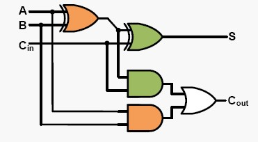
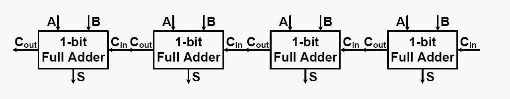

Quiz 3 - Week 4
===============
1、(5分)下列哪些和时间相关的名词，是属于D触发器的特性？

**A、 CLK-to-Q time**

 **B、 Setup time**

 **C、 Hold time**

 D、 Select time

 E、 Input time

 F、 Output time

 G、 Access time

 2、(5分)对于一个4输入或门，当输入信号为1010和0110，输出信号为：

 **A、 1110**

 B、 1100

 C、 0011

 D、 0110

 E、 1010

 F、 1011

3、(5分)对于一个4输入与门，当输入信号为1010和0110，输出信号为：

**A、 0010**

 B、 1110

 C、 1001

 D、 0110

 E、 1010

 F、 1011

4、(5分)对于一个4输入异或门，当输入信号为1010和0110，输出信号为：

 **A、 1100**

 B、 1110

 C、 0011

 D、 0110

 E、 1010

 F、 1011

5、(5分)要对一个有符号的立即数和某个寄存器中的值进行加法运算，应当用的MIPS指令是：

 **A、 addi rt,rs,imm**

 B、 and rt,rs,imm

 C、 andi rt, imm, rs

 D、 addi rt, imm, rs

 E、 andi rt,rs,imm

 F、 addiu rt,rs,imm

6、(5分)要对一个立即数和某个寄存器中的值进行逻辑与运算，应当用的MIPS指令是：

 **A、 andi rt,rs,imm**

 B、 and rt,rs,imm

 C、 addi rt, imm, rs

 D、 addiu rt,rs,imm

 E、 addi rt,rs,imm

7、(5分)对于半加器和全加器，下列描述正确的是：

 **A、 半加器虽能产生进位输出，但半加器本身并不能处理进位输入**

 B、 半加器能产生进位输出，也能处理进位输入

 C、 半加器既不能产生进位输出，也不能处理进位输入

 D、 全加器虽能产生进位输出，但全加器本身并不能处理进位输入

 E、 全加器既不能产生进位输出，也不能处理进位输入

 F、 全加器虽能处理进位输入，但全加器本身并不能产生进位输出

8、(5分)对于如图所示的全加器，当A、B和进位输入Cin分别为1、0、1时，输出端口S和进位输出Cout为：

 **A、 S=0，输出进位1**

 B、 S=1，输出进位1

 C、 S=1，输出进位0

 D、 S=0，输出进位0

9、(5分)对于“溢出”和“进位”，下列描述正确的是：

 **A、 “溢出”只针对有符号数**

 **B、 有“进位”时，不一定有“溢出”**

 **C、 有“溢出”时，不一定有“进位”**

 D、 有“进位”时，一定有“溢出”

 E、 “溢出”可以针对无符号数

10、(5分)“溢出”的检测方法是：

 **A、 “最高位的进位输入”不等于“最高位的进位输出”**

 B、 “最高位的进位输入”等于“最高位的进位输出”

 C、 “最高位的进位输入”不等于“次高位的进位输出”

 D、 “最高位的进位输入”等于“次高位的进位输出”

 E、 “最高位的进位输入”不等于“最低位的进位输出”

 F、 “最高位的进位输入”等于“最低位的进位输出”

11、(5分)MIPS和x86对溢出的处理方式是：

 **A、 对于MIPS，提供两类不同的指令分别处理，分别是：将操作数看做有符号数，发生“溢出”时产生异常；将操作数看做无符号数，不处理“溢出”**

 **B、 对于x86，利用程序状态字寄存器中的OF位，发生溢出，设置OF=1**

 C、 对于MIPS，提供两类不同的指令分别处理，分别是：将操作数看做无符号数，发生“溢出”时产生异常；将操作数看做有符号数，不处理“溢出”

 D、 对于x86，利用程序状态字寄存器中的ZF位，发生溢出，设置ZF=1

 E、 对于x86，利用标志寄存器中的OF位，发生溢出，设置OF=0

12、(5分)为了使十进制表示的算式（8-3）能够在二进制补码加法器上运算，可以表示的形式为：

 **A、 1000+1101**

 B、 0011+0011

 C、 1000-1011

 D、 1000-0011

 E、 0011+1101

 F、 1000+1011

13、(5分)假设一个基本逻辑门延迟为T，对于4-bit行波进位加法器的关键路径延迟为：

 **A、 9T**

 B、 6T

 C、 7T

 D、 8T

 E、 10T

 F、 11T

14、(5分)超前进行加法器相对于行波进位加法器的优化思路是：

 **A、 提前计算出“进位输出信号”**

 B、 简化电路实现的复杂程度

 C、 适用更宽位的加法运算

 D、 节省基本逻辑门之间的连线

15、(5分)关于行波进位加法器和超前进位加法器各自的优缺点描述正确的是：

 **A、 行波进位加法器门延迟比超前进位加法器更长**

 **B、 行波进位加法器电路实现相对简单**

 C、 超前进位加法器门延迟比行波进位加法器更长

 D、 行波进位加法器电路实现更加复杂

 E、 超前进位加法器电路实现更加简单

16、(5分)对于4-bit超前进位加法器，如何用生成信号Gi和传播信号Pi表示 C2：

 **A、 G1+P1•G0+P1•P0•C0**

 B、 P1•G0+P1•P0•C0

 C、 G1+P1+P0

 D、 G1+P1+P0•C0•G0

 E、 G1 +P1•P0•C0

 F、 G1+P1+C0

17、(5分)假设一个基本逻辑门延迟为T，4-bit超前进位加法器产生和的门延迟为：

 **A、 4T**

 B、 3T

 C、 5T

 D、 6T

 E、 7T

 F、 9T

18、(5分)假设一个基本逻辑门延迟为T，超前进位加法器计算Ci+1产生的门延迟为：

 **A、 3T**

 B、 4T

 C、 5T

 D、 6T

 E、 7T