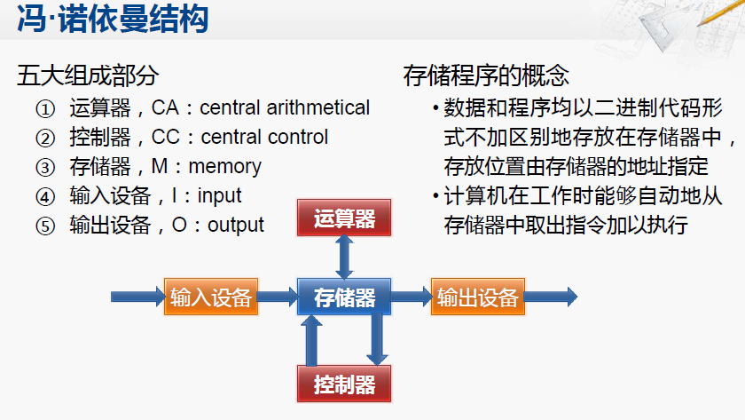

https://zhuanlan.zhihu.com/p/38534417

总复习
===

## 冯·诺伊曼结构

## Cache写回策略

1. Write Back 写回法：只有在一个cache行呗选中替换回主存时，如果cache行的数据是修改过的(dirty)，才将它写回主存。
2. Write Through 写通过法：每当cache收到写数据指令时，若写命中，则CPU会同时将数据写到Cache和主存。当某一块需要替换时，不必把这一块写回主存，将新调入的块直接覆盖即可。

[cache写回策略](https://blog.csdn.net/dark5669/article/details/53895744)

## 突发传输
突发传输一般表示的是两个设备之间进行数据传送的一种模式，也可将其称为突发模式下的数据传输。而突发（Burst）是指在同一行中相邻的存储单元连续进行数据传输的方式，连续传输的周期数就是突发长度（Burst Lengths，简称BL）。在突发传输模式下，多个数据单元当做一个单元（相当一个数据块）来传送，从而提高了传输效率。突发方式将整个信道专用于传送一个源节点的数据。具有突发方式功能的设备常常为成组方式操作提供最大吞吐率。

## 时钟中断

- 时钟中断的产生

Linux的OS时钟的物理产生原因是可编程定时/计数器产生的输出脉冲，这个脉冲送入CPU，就可以引发一个中断请求信号，我们就把它叫做时钟中断。

“时钟中断”是特别重要的一个中断，因为整个操作系统的活动都受到它的激励。系统利用时钟中断维持系统时间、促使环境的切换，以保证所有进程共享CPU；利用时钟中断进行记帐、监督系统工作以及确定未来的调度优先级等工作。可以说，“时钟中断”是整个操作系统的脉搏。

从本质上说，时钟中断只是一个周期性的信号，完全是硬件行为，该信号触发CPU去执行一个中断服务程序，但是为了方便，我们就把这个服务程序叫做时钟中断。

每个时钟滴答，时钟中断得到执行。时钟中断执行的频率很高：100次/秒，时钟中断的主要工作是处理和时间有关的所有信息、决定是否执行调度程序以及处理下半部分。和时间有关的所有信息包括系统时间、进程的时间片、延时、使用CPU的时间、各种定时器，进程更新后的时间片为进程调度提供依据，然后在时钟中断返回时决定是否要执行调度程序。下半部分处理程序是Linux提供的一种机制，它使一部分工作推迟执行。时钟中断要绝对保证维持系统时间的准确性，而下半部分这种机制的提供不但保证了这种准确性，还大幅提高了系统性能。
