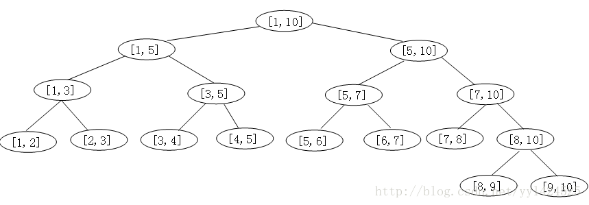

补充材料
====
## SplayTree 伸展树

SplayTree设计思想：

1. （二八原则）20%的数据是经常操作的，剩下的80%的数据很少操作。
2. 旋转到根 -- 每插入或者删除一个结点，都把插入的结点（删除的结点）旋转到根。

SplayTree简介

伸展树是对二叉查找树的一种改进，虽然它并不能保证树一直是平衡的，但是对于伸展树的一系列操作，可以证明其每一步操作的平摊复杂度都是O(logn)。所以从某种意义上来说，伸展树也是一种平衡的二叉查找树。

伸展树中的每一个结点x都满足：该结点左子树中的每一个元素都小于x，该节点右子树中的每一个元素都大于x。

伸展操作--Splay(x,S)

伸展操作Splay(x,S)是再保持伸展树有序性的前提下，通过一系列旋转将伸展树S中的元素x调整至树的根部。在调整的过程中，要分一下三种情况分别处理：

1. 节点x的父节点y是根节点。

    这时如果x是y的左孩子，进行一次Zig（右旋）操作；如果x是y的右孩子，进行一次Zag（左旋）操作。经过旋转，x成为二叉查找树S的根节点，调整结束。
2. 节点x的父节点y不是根节点，y的父节点位为z，且x与y同时是各自父节点的左孩子或者右孩子。

    进行一次Zig_Zig操作或者Zag_Zag操作
3. 节点x的父节点y不是根节点，y的父节点位为z，且x与y中一个是其父节点的左孩子而另一个是其父节点的右孩子。
    进行一次Zig_Zag操作或Zag_Zig操作。

SplayTree API

1. find(x,S)  判断元素x是否在伸展树S表示的有序集中

    首先与二叉查找树一样，在伸展树中查找元素x。如果在树中，执行Splay(x, S)调整伸展树
2. insert(x, S)

    首先与二叉查找树一样，将x插入到伸展树S中的相应位置上，再执行Splay(x, S)调整伸展树
3. delete(x, S)

    首先与二叉查找树一样找到x的位置，如果x没有孩子或者只有一个孩子，那么直接将x删除，并通过Splay(x, S)操作，将x节点的父节点调整到伸展树的根节点处。

    否则向下查找x的后继y，用y替代x的位置，最后执行Splay(x, S)，将y调整为伸展树的根。
4. join(S1, S2)  将两个伸展树S1与S2进行合并，其中S1的所有元素都小于S2的所有元素。

    首先找到伸展树S1中最大的一个元素x，再通过Splay(x, S1)将x调整到伸展树S1的根。然后再将S2作为x节点的右子树。这样就得到了伸展树S。
5. split(x, S)  以x为界， 将伸展树S分离为两颗伸展树S1和S2，其中S1中所有元素都小于x，S2中所有元素都大于x

    首先执行find(x, S)，将元素x调整到伸展树的根节点，则x的左子树就是S1，右子树就是S2

- Inference

    [《伸展树的基本操作与应用》 --杨思雨](https://github.com/ericliu859/AcmPaper/blob/master/%E6%95%B0%E6%8D%AE%E7%BB%93%E6%9E%84/Splay/2004%20-%20%E6%9D%A8%E6%80%9D%E9%9B%A8%EF%BC%9A%E3%80%8A%E4%BC%B8%E5%B1%95%E6%A0%91%E7%9A%84%E5%9F%BA%E6%9C%AC%E6%93%8D%E4%BD%9C%E4%B8%8E%E5%BA%94%E7%94%A8%E3%80%8B/%E6%9D%A8%E6%80%9D%E9%9B%A8.pdf)

    [《运用伸展树解决数列维护问题》 -- Crash](https://github.com/EnigmaHuang/ACM-ICPC-Algorithm/blob/master/%E6%95%B0%E6%8D%AE%E7%BB%93%E6%9E%84/Splay%E6%A0%91/%E8%BF%90%E7%94%A8%E4%BC%B8%E5%B1%95%E6%A0%91%E8%A7%A3%E5%86%B3%E6%95%B0%E5%88%97%E7%BB%B4%E6%8A%A4%E9%97%AE%E9%A2%98.pdf)

    [伸展树操作详解 --Ma shuo](https://wenku.baidu.com/view/cc211f126edb6f1aff001f16.html)

    [伸展树的学习](http://blog.51cto.com/sbp810050504/1026990)

## 线段树

首先，线段树是一棵二叉树。不同的是，线段树每个结点表示的是一个线段，或者说是一个区间。

一棵线段树的根结点表示的是“整体”区间，而它的左右子树也是一棵线段树，分别表示区间的左半边和右半边。

树中的每个结点表示一个区间[a,b]。每一个叶子结点表示一个单位区间。

对于每一个非叶结点所表示的结点[a,b]，其左孩子表示的区间为[a,(a+b)/2]，右孩子表示的区间为[(a+b)/2,b]。

用T(a, b)表示一棵线段树，参数a,b表示区间[a,b]，其中b-a称为区间的长度，记为L。

线段树主要用于高效解决连续区间的动态查询问题，由于二叉结构的特性，使用线段树可以快速的查找某一个节点在若干条线段中出现的次数，时间复杂度为O(logN）。

而未优化的空间复杂度为2N，因此有时需要离散化让空间压缩。

- 线段树的实现

[java实现](https://blog.csdn.net/yyl424525/article/details/77859911)

## 三元组&十字链表
[稀疏矩阵的十字链表存储的思路](https://blog.csdn.net/zhuyi2654715/article/details/6729783)

## 尾递归（以斐波那契数列为例）

