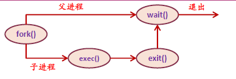
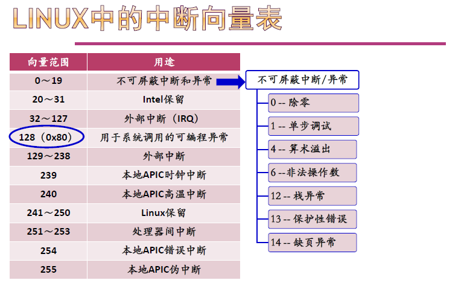
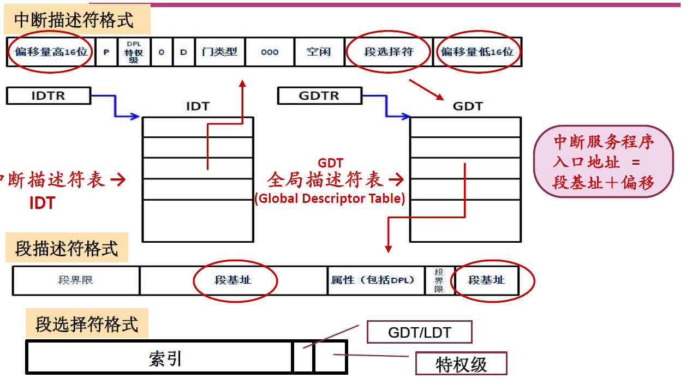
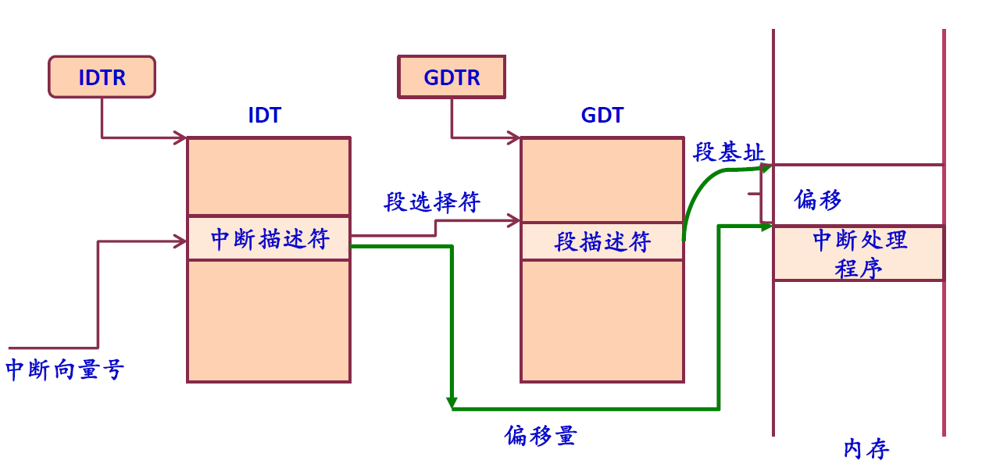

重难点总结补充
=======
<!-- TOC -->
- [UNIX的fork()实现](#UNIX的fork()实现)
- [Linux系统调用的实现](#Linux系统调用的实现)
<!-- TOC -->

## UNIX的fork()实现

fork() 通过复制调用进程来建立新的进程，是最基本的进程建立过程。

- 为子进程分配一个空闲的进程描述符PCB(proc结构)
- 分配给子进程唯一标识pid
- 以一次一页的方式复制父进程地址空间(Linux采用了写时复制技术COW(Copy-On-Write)加快创建进程)
- 从父进程处继承共享资源，如打开的文件和当前工作目录等
- 将子进程的状态设为就绪态，插入到就绪队列
- 对子进程返回标识符0
- 向父进程返回子进程的pid



***父子进程执行没有固定的先后顺序，哪个进程先执行要看系统的进程调度策略。***

``` c++
#include<sys/types.h>
#include<stdio.h>
#include<unistd.h>

void main(int argc, char *argv[])
{
    pid_t pid;
    pid = fork();   /*创建一个子进程*/
    if(pid < 0){            /*出错*/
        fprintf(stdeer, "fork failed!");
        exit(-1);
    }
    else if(pid == 0){        /*子进程*/
        execlp("/bin/ls","ls",NULL);
    }
    else{                       /*父进程*/
        wait(NULL);
        printf("child complete");
        exit(0);
    }
}
```

考题中不必纠结父进程子进程的打印顺序，重要的是相关变量（共享资源）值的变化！

Copy-On-Write
写入时复制（英语：Copy-on-write，简称COW）是一种计算机程序设计领域的优化策略。其核心思想是，如果有多个调用者（callers）同时请求相同资源（如内存或磁盘上的数据存储），他们会共同获取相同的指针指向相同的资源，直到某个调用者试图修改资源的内容时，系统才会真正复制一份专用副本（private copy）给该调用者，而其他调用者所见到的最初的资源仍然保持不变。这过程对其他的调用者都是透明的（transparently）。此作法主要的优点是如果调用者没有修改该资源，就不会有副本（private copy）被建立，因此多个调用者只是读取操作时可以共享同一份资源。

虚拟内存管理中的写时复制
一般把这种被共享访问的页面标记为只读。当一个task试图向内存中写入数据时，内存管理单元（MMU）抛出一个异常，内核处理该异常时为该task分配一份物理内存并复制数据到此内存，重新向MMU发出执行该task的写操作。

具体在这里，根据陈向群老师的口述，我们可以总结为，采用COW策略的子进程获得的不再是父进程的资源，而是指向这些资源的指针，同时父进程把这些资源标志位置为只读，这样在子进程试图写入、修改这些资源时，才会由操作系统重新分配真正的属于自己的资源。

- Inference
[linux中fork（）函数详解（原创！！实例讲解）](https://blog.csdn.net/jason314/article/details/5640969)
[fork （函数）](https://baike.baidu.com/item/fork/7143171)
[wiki/写入时复制](https://zh.wikipedia.org/wiki/%E5%AF%AB%E5%85%A5%E6%99%82%E8%A4%87%E8%A3%BD)

## Linux系统调用的实现

Linux中的中断向量表



x86处理器对中断的支持

- 中断控制器（PIC或APIC）：负责将硬件的中断信号转换为中断向量，并引发CPU中断
- 中断向量表（实模式,Interrupt Vector) ：存放中断服务程序的入口地址，入口地址=段地址左移4位+偏移地址；不支持CPU运行状态的转换；中断处理与一般的过程调用相似
- 中断描述符表(保护模式, Interrupt Descriptor Table) ：采用门（gate）描述符数据结构表示中断向量

中断向量表/中断描述符表

四种类型门描述符

1. 任务门
2. 中断门 给出段选择符、中断/异常程序的段内偏移量；通过中断门后系统会自动禁止中断（关中断）
3. 陷阱门 与中断门类似，但通过陷阱门后系统不会自动禁止中断
4. 调用门





中断/异常的硬件处理过程：
1. 确定与中断或异常关联的向量i
2. 通过IDTR寄存器找到IDT表，获得中断描述符（表中的第i项）
3. 从GDTR寄存器获得GDT的地址；结合中断描述符中的段选择符，在GDT表获取对应的段描述符；从该段描述符中得到中断或异常处理程序所在的段基址
4. 特权级检查；如果发生了特权级的变化，则进行堆栈切换（必须使用与新的特权级相关的栈）
5. 硬件压栈，保存上下文环境；如果异常产生了硬件出错码，也将它保存在栈中
6. 如果是中断，清IF位
7. 通过中断描述符中的段内偏移量和段描述符中断的基地址，找到中断/异常处理程序的入口地址，执行其中的第一条指令

陷入指令选择128号
```
    int $0x80
```
门描述符
- 系统初始化时：对IDT表中的128号门初始化


## 反向页表

[反向页表](https://baike.baidu.com/item/%E5%8F%8D%E5%90%91%E9%A1%B5%E8%A1%A8/3565803?fr=aladdin)

[virginia_cs/inverted Page Tables](http://172.16.24.175/www.cs.virginia.edu/~cs333/notes/virtual_memory4.pdf)

## 哲学家就餐问题

## Peterson算法

## 管程

## 同步机制的状态


