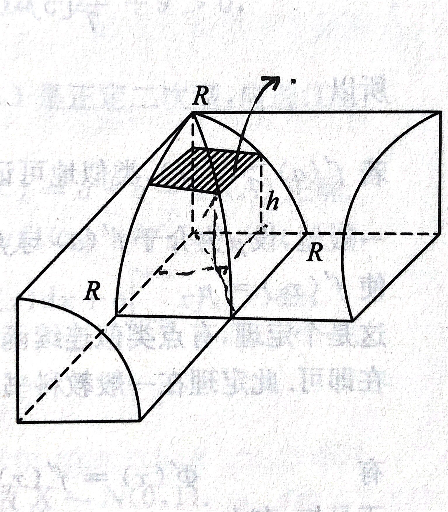

## 数列&极限
1. (张宇八套卷(一).10)

2. (张宇八套卷(三).01)设g(x)在x=0的某邻域内连续且

.又设f(x)在该邻域内存在二阶导数且满足

。则

A.f(0)是f(x)的极大值

**B.f(0)是f(x)的极小值**

C.f(0)不是f(x)的极值

D.f(0)是否为f(x)的极值要由具体的g(x)决定

由题意易知，

从而得到，

然后对所给方程左右两边同除x^2,并求极限

所以，
根据函数的保号性f'(x)在x=0的一个邻域内单调递减，又f'(0)=0,所以f(0)是f(x)的极小值。

3.(张宇八套卷(二).12)设

夹逼定理：

## 反常积分
1. (2016.1)若反常积分

收敛，则

    A.a<1且b>1

    B.a>1且b>1

    **C.a<1且a+b>1**

    D.a>1且a+b>1

    两个重要结论：无穷区间的反常积分
    
    ：在p>1时收敛，在p<=1时发散；无界函数的反常积分
    
    （奇点x=0)：在p<=1时收敛，在p>1时发散。

    本题首先需要把左奇点右无限区间的反常积分化为单边反常积分：

    

    由于
    
    ，
    
    与
    
    同敛散，故a<1时其收敛；

    由于
    
    ，
    
    与
    
    同敛散，故a+b>1时收敛。

    综上，则a<1且a+b>1时反常积分
    
    收敛

## 空间解析几何与向量代数
1. (张宇八套卷(一).01)

作水平刨面，此刨面切在离底h处，图中阴影是一个正方形，此正方形的边长为

。于是正方形的面积为

。用微元法，薄片的厚度为dh,薄片的体积：

图中画的是整个公共部分的1/8，所以所求公共部分是

。

2. (张宇八套卷(二).04)空间n个点

矩阵

的秩记为r，则n个点共面的充分必要条件是（）

A. r=1 B. r=2 C. r=3 **D.1<=r<=3**

设这n个点共面，则其中任取4个点，例如P1,P2,P3和P4也必共面。于是

最后一个行列式为0来自三点式平面方程，所以D项正确。

反之，设1<=r<=3，则A中任取一个4阶矩阵，其对应的行列式必为零，因此4点必共面，所以这n个点必共面。

## 多元函数微分

## 无穷级数
(2016.19)已知函数f(x)可导，且f(0)=1,

,设数列

满足

证明：

1）级数

绝对收敛

2）

存在，且

证明：

1）若要证明级数

绝对收敛，即证明

收敛。

依题意，利用比较审敛法：

其中，

介于

之间

显然，无穷级数

收敛，所以根据比较审敛法，无穷级数

收敛，即无穷级数

绝对收敛。

2）由1）问结论，无穷级数

绝对收敛，则其部分和的极限

存在，即

存在。

设

由于f(x)可导，从而f(x)连续，对

等式两边取极限得 a = f(a)

又 

其中，

介于

之间

同样，对等式两边取极限

则，

所以

,即

题设得证。

## 线性方程组
(张宇八套卷(三).06)设A是3阶矩阵，

是非齐次线性方程组Ax=b的解向量，其中

则

A. t=-1时，必有r(A)=1

B. t=-1时，必有r(A)=2

**C. t!=-1时，必有r(A)=1**

D. t!=-1时，必有r(A)=2

记

由

是Ax=b的解向量，t!=-1时，r(B)=3,知

线性无关，

是对应其次方程组Ax=0的两个线性无关解，故r(A)=<1

若A=O，则Ax=b无解，故r(A)>0，综上r(A)=1

## 随机事件和概率

1. (张宇八套卷(二).07) 设A,B为两个事件，若P(B)>0,则下列结论正确的是（）

A.

B.

C.P(A|B)" title="P(A|A\cup B)>P(A|B)" />

D.

设P(A-B)=x,P(B-A)=y,P(AB)=z,

D项正确！

## 一维随机变量函数的分布

(2016.22)设二维随机变量(X,Y)在区域

上服从均匀分布，令

3)求Z=U+X的分布函数F(z)

首先求出(X,Y)的概率密度f(x,y)

其中

为区域D的面积

然后开始求F(z)

